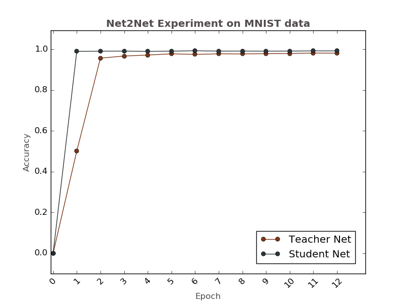
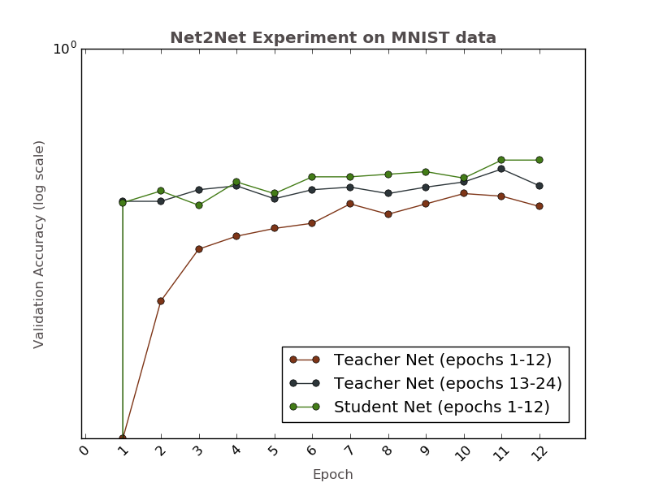

# net2net_demo
This repository includes the demo scripts to use Net2Net method to make net deeper and wider
on Keras framework. The Net2Net class was implemented by [Kyunghyun Paeng](https://github.com/paengs/Net2Net) in python
which can take any weight matrix as input and return the optimized weights. I found this implementation is very useful because it is independent of the deep learning framework. 
The reference of the demo net was from the [mnist_cnn.py](https://github.com/fchollet/keras/blob/master/examples/mnist_cnn.py) in the Keras examples.

## Usage
```
THEANO_FLAGS=exception_verbosity=high,device=gpu,floatX=float32 python mnist_net2net.py
```
Replace NEWLAYERS with different layer you would like to use to expand
your network.

* Parameters:
 * insert_pos - index of the newly inserted layer
 * layers     - a list of layers to be inserted

* Examples
 * Insert a FC layer:
   ```
    NEWLAYERS = {'insert_pos': 8,
                 'layers': [Dense(128)]}
    ```
 * Insert a Conv layer:
    ```
    NEWLAYERS = {'insert_pos': 2,
                 'layers': [Activation('relu'),
                            Convolution2D(NB_FILTERS, NB_CONV, NB_CONV),
                            ZeroPadding2D((1, 1))]}
    ```
Padding is required to keep the size of the convolutional layers the same before and after the expansion.

## Result

By adding one additional convolutional layer to the original net, one can get better results without training from scratch. Net2DeeperNet achieves a better validation accuracy (>99%) within 12 epochs.



